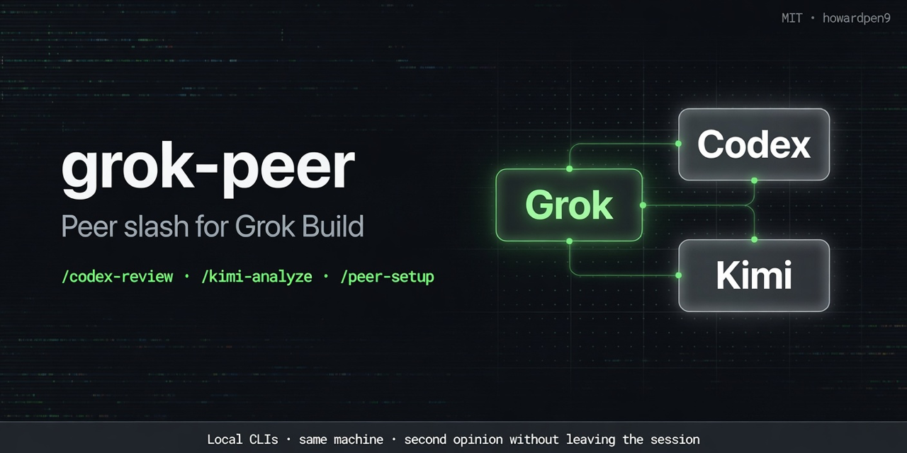

# grok-peer

<!-- social preview: assets/social-preview.png -->
<p align="center">
  
</p>


**Peer slash commands for [Grok Build](https://x.ai/cli)** — call local **Codex** and **Kimi** the way Claude users call `/codex`.

Grok is the conductor. Peers stay on their own CLIs (and logins). This plugin is the **call surface**, not a second ADE and not a remote multi-agent service.

| Slash | What it does |
| --- | --- |
| `/peer-setup` | Check that `codex` / `kimi` are on PATH |
| `/codex-review` | `codex review` on uncommitted changes (or `--base <ref>`) |
| `/codex-adversarial` | Challenge-style Codex review |
| `/kimi-analyze` | One-shot Kimi analysis of the current repo |

## Install

### Local path (dogfood)

```bash
grok plugin validate .
grok plugin install . --trust
```

### From GitHub (after public push)

```bash
# dedicated repo (recommended for marketplace)
grok plugin install howardpen9/grok-peer --trust

# or monorepo subdir while nesting lives under coding-agent-mcps
grok plugin install howardpen9/coding-agent-mcps#grok-peer --trust
```

### Official marketplace (after PR merge)

Browse in Grok Build (`/marketplace` / `/plugin`) and install **grok-peer**, or follow [xai-org/plugin-marketplace](https://github.com/xai-org/plugin-marketplace).

## Prerequisites

- [Grok Build](https://x.ai/cli) (`grok`)
- [Codex CLI](https://github.com/openai/codex) + `codex login` — for `/codex-*`
- [Kimi Code CLI](https://www.kimi.com/code) + `kimi login` — for `/kimi-analyze`

Optional overrides: `CODEX_BIN`, `KIMI_BIN`, `CLAUDE_BIN`.

## Security

See [SECURITY.md](./SECURITY.md). Short version: scripts only shell out to **local** `codex` / `kimi`. Network and auth are entirely those CLIs’ responsibility under **your** existing logins. No plugin-side telemetry or secret harvesting.

## Design

```
Claude main + /codex     →  openai/codex-plugin-cc (official)
Grok main  + /codex-*    →  this plugin
Any host   + MCP tools   →  howardpen9/kimi-code-mcp, howardpen9/grok-mcp
Parallel long jobs       →  Orca worktrees (not this)
```

## Layout (marketplace-ready)

```text
grok-peer/
  .grok-plugin/plugin.json
  LICENSE
  README.md
  SECURITY.md
  commands/          # slash commands
  scripts/           # local peer runners
```

## Development

```bash
chmod +x scripts/*.sh
./scripts/peer-setup.sh
grok plugin validate .
```

## License

MIT — see [LICENSE](./LICENSE).

## Unofficial notice

Not affiliated with, endorsed by, or sponsored by xAI, OpenAI, or Moonshot. “Grok”, “Codex”, and “Kimi” are trademarks of their respective owners; names are used only for interoperability.
