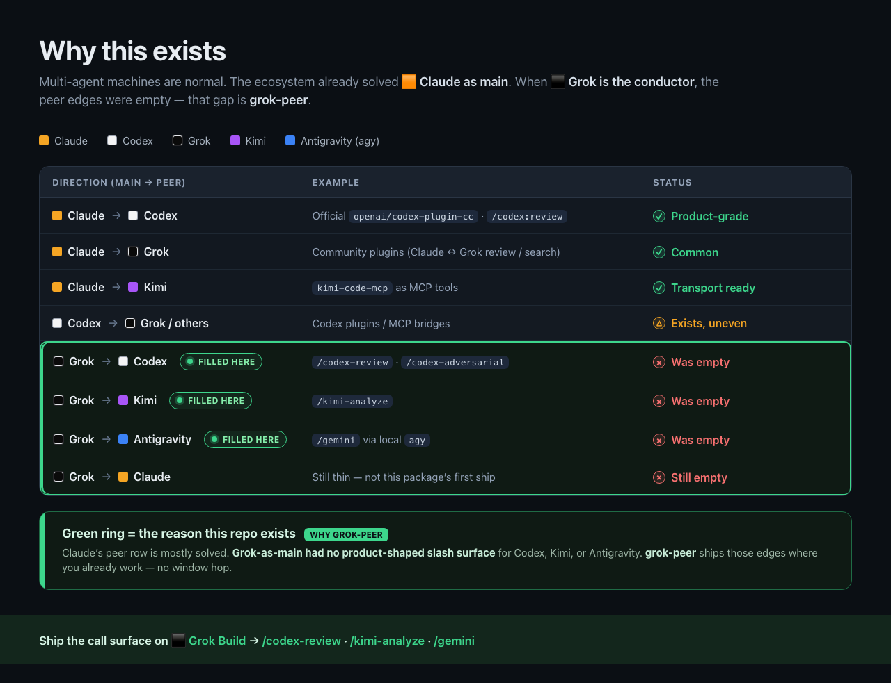
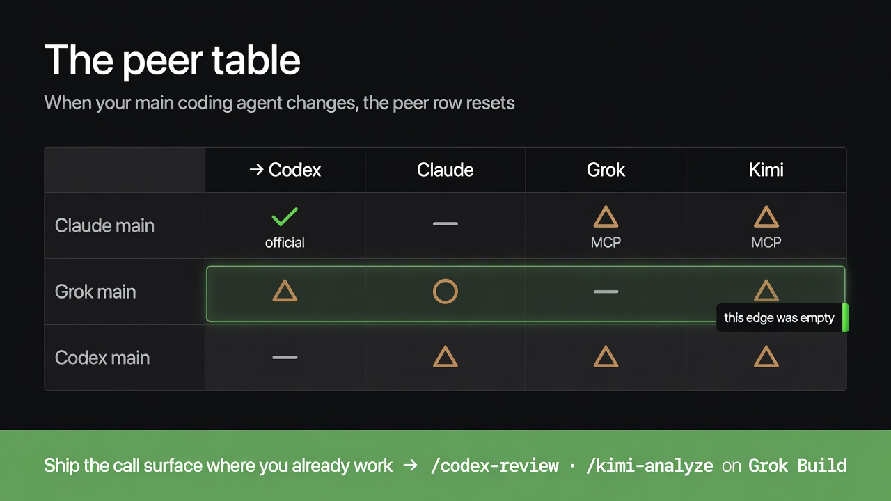
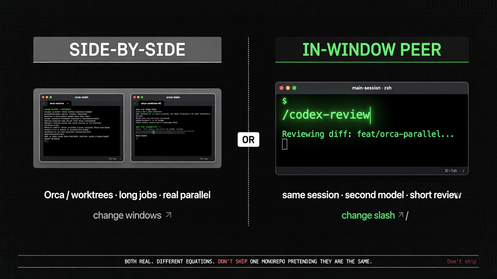

# grok-peer

<!-- social preview: assets/social-preview.png -->
<p align="center">
  
</p>

<p align="center">
  <strong>Peer slash for <a href="https://x.ai/cli">Grok Build</a></strong><br/>
  Call local <strong>Codex</strong>, <strong>Kimi</strong> &amp; <strong>Antigravity (<code>agy</code>)</strong> without leaving Grok — the missing edge when Grok is the conductor.
</p>

<p align="center">
  <a href="https://github.com/howardpen9/grok-peer/blob/main/LICENSE"></a>
  <a href="https://github.com/xai-org/plugin-marketplace/pull/84"></a>
  
  
</p>

---

## Why this exists

In 2026 most machines run **several** coding agents at once — Claude Code, Codex, Grok Build, Kimi, Antigravity, Cursor… each with its own login and quota. The ecosystem already solved **🟧 Claude as main**. When **⬛ Grok is the conductor**, the peer edges were empty.

<p align="center">
  
</p>

<p align="center"><sub>
  Color key: 🟧 Claude · ⬜ Codex · ⬛ Grok · 🟪 Kimi · 🟦 Antigravity (<code>agy</code>).
  Green ring = the gap this package ships.
</sub></p>

**This package fills the Grok-as-main (⬛) row.** If your daily driver is **Grok Build**, opening Claude just to run `/codex` is the wrong UX — peers should live **where you already are**.

<details>
<summary>Text table (same data, accessible / copy-paste)</summary>

| Direction (main → peer) | Example | Status |
| --- | --- | --- |
| **🟧 Claude → ⬜ Codex** | Official [`openai/codex-plugin-cc`](https://github.com/openai/codex-plugin-cc) (`/codex:review`, …) | ✅ Product-grade |
| **🟧 Claude → ⬛ Grok** | Community plugins (e.g. Claude↔Grok review / search wrappers) | ✅ Common |
| **🟧 Claude → 🟪 Kimi** | [`kimi-code-mcp`](https://github.com/howardpen9/kimi-code-mcp) as MCP tools | ✅ Transport ready |
| **⬜ Codex → ⬛ Grok / others** | Codex plugins / MCP bridges | △ Exists, uneven |
| **⬛ Grok → ⬜ Codex** | `/codex-review` · `/codex-adversarial` | ❌ Was empty *(filled here)* |
| **⬛ Grok → 🟪 Kimi** | `/kimi-analyze` | ❌ Was empty *(filled here)* |
| **⬛ Grok → 🟦 Antigravity (`agy`)** | `/gemini` via local `agy` | ❌ Was empty *(filled here)* |
| **⬛ Grok → 🟧 Claude** | — | ❌ Still empty |

</details>

<p align="center">
  
</p>

<p align="center"><sub>Matrix view: rows = conductor (main). Columns = peer. Official depth sits on Claude → Codex. Grok’s row was the gap.</sub></p>

---

## Peer table (what “solved” actually means)

| Main agent ↓ · Peer → | Codex | Claude | Grok | Kimi | 🛸 Antigravity (`agy`) |
| --- | :---: | :---: | :---: | :---: | :---: |
| **Claude** | ✅ Official slash + app-server | — | △ MCP / community plugins | △ MCP (`kimi-code-mcp`) | △ CLI |
| **🚀 Grok Build** | **✅ This plugin** (`/codex-*`) | planned | — | **✅ This plugin** (`/kimi-analyze`) | **🚀 ✅ This plugin** (`/gemini`) |
| **Codex** | — | △ | △ | △ | △ |

> **🚀 Highlight — Grok can spin Gemini-family LLM tasks.**  
> Product name: **`/gemini <task>`** (like `/kimi-analyze`). Transport: local `agy` (Antigravity).  
> Default = implement with `--dangerously-skip-permissions` · `/gemini --review` = safe second opinion.  
> **Not image gen** — host `/imagine` for pictures.

| Symbol | Meaning |
| --- | --- |
| ✅ | Product-shaped slash / deep plugin |
| 🚀 | Grok-as-main peer path shipped here |
| △ | CLI, MCP, or hand-rolled skill — works but not “feels like `/codex`” |
| — | Same agent / N/A |

Related transports (any MCP host, **not** Grok-native slash):

| Package | Role when *another* host is main |
| --- | --- |
| [`openai/codex-plugin-cc`](https://github.com/openai/codex-plugin-cc) | Claude → Codex peer UX |
| [`howardpen9/grok-mcp`](https://github.com/howardpen9/grok-mcp) | Host → Grok as reviewer / chat tools |
| [`howardpen9/kimi-code-mcp`](https://github.com/howardpen9/kimi-code-mcp) | Host → Kimi bulk reader (256K-style jobs) |
| **`grok-peer` (this repo)** | **Grok Build → Codex / Kimi / Antigravity call surface** |

---

## Host media (image/video) ≠ peer slash

This is the confusion that shows up most often. **Peer call surface** and **host-native image generation** are different layers. Mixing them makes the table above look like it “adds Imagine.”

### Three layers (keep them separate)

| Layer | Where you sit | What it does | Image / video gen? |
| --- | --- | --- | --- |
| **A · Host-native media** | Inside that product as **main** | Product’s own media tools | ✅ Built into that host (Grok: `/imagine`) |
| **B · In-window peer** (this plugin) | **Grok Build** as main | Slash → local peer CLI | Code always; **optional** `/gemini --image` = **agy** Gemini image (not Grok Imagine) |
| **C · MCP / community bridges** | Claude Code, Cursor, … as main | Tools → another model or API | Only if that package exposes Imagine/API image tools |

### Host-native media (layer A) — no plugin required

| Host (as main agent) | How you generate media | Engine (roughly) |
| --- | --- | --- |
| **Grok Build** | Built-in `/imagine`, `/imagine-video` (and agent Imagine tools) | **Grok Imagine** (xAI) — **image + video** |
| **Antigravity (`agy`)** | Ask for images while working **inside** Antigravity / Gemini agent | **Nano Banana / Gemini Image** (Google) — **images only** |
| **Codex CLI / app** | Built-in imagegen skill / `image_gen` (ChatGPT login; feature `image_generation`) | **gpt-image** — **images only** (no videogen skill; Sora ≠ Codex built-in). Verified 2026-07-17. |
| Claude Code, … | Host features or MCP (e.g. sibling **`grok-build-media`** for Grok subscription media) | Varies |

> **This plugin’s `/codex-*` is code review, not image gen.** To get Codex images, run **Codex as main**, not `/codex-review` from Grok. Full multi-engine SoT: [`../docs/GROK-MEDIA.md`](../docs/GROK-MEDIA.md).

So:

- Want a **Grok Imagine** picture **in Grok Build** → host **`/imagine`** (default).
- Want a **Gemini / Antigravity** picture **without leaving Grok** → **`/gemini --image`** (peer spin; same `agy` wire as coding).
- Want to work **inside** Antigravity as main → use its native image tools there.

### What this plugin’s `/gemini` (and `/agy-*`) actually is (layer B)

| Slash | Means | Does **not** mean |
| --- | --- | --- |
| **`/gemini <task>`** | Spin an **LLM coding task** to Antigravity/Gemini via local `agy` (like `/kimi-analyze`) | Grok host media |
| `/gemini --review` | Read-only second opinion | Imagine / image gen |
| `/gemini --image` | Spin **agy `generate_image`** (Gemini / Nano Banana stack) | Grok **`/imagine`** (xAI) — different engine |
| `/agy-run`, `/agy-review` | Aliases of code modes | Preferred name is **`/gemini`** |
| `/codex-*`, `/kimi-analyze` | Same peer idea for Codex / Kimi | Media generation |

**Peer = different model on the same coding job (review / run / scan).**  
**Media = host product feature** (`/imagine` in Grok Build).

### Related packages people mix up (layer C)

| Package | Job | Image gen? |
| --- | --- | --- |
| **`grok-peer` (this repo)** | Grok → Codex / Kimi / `agy` peer slash | ❌ |
| [`howardpen9/grok-mcp`](https://github.com/howardpen9/grok-mcp) | Any MCP host → Grok as **reviewer / second opinion** | ❌ (by design) |
| [`grok-build-media`](../grok-build-media) (sibling in monorepo) | Claude Code / other hosts → **local Grok Build** Imagine (OAuth **subscription** quota) | ✅ image + video via `grok -p` — **not** this plugin, **not** API-key Imagine |
| Community **xAI / Grok Imagine MCP**s (e.g. full-API servers with `generate_image`) | Claude Code / other hosts → xAI image (and often chat/search) **API key** | ✅ Separate category — **not** Grok Build TUI, **not** this plugin |

### Common misconceptions

| Misconception | Reality |
| --- | --- |
| “Install grok-peer so Grok can make images” | Grok Build **already** has `/imagine`. This plugin is peers only. |
| “`/gemini` is Grok Imagine” | No. Default `/gemini` is coding. **`/gemini --image`** is Antigravity Gemini image via `agy`. Grok Imagine = host **`/imagine`**. |
| “Antigravity can make images, so the peer table means Grok gets that too” | Antigravity media works when **Antigravity is the host**. Peer slash does not re-export the host’s media stack. |
| “`grok-mcp` = full Grok Build (including Imagine) inside Claude” | `grok-mcp` is peer **review/chat tools** over API/CLI, not the Grok Build TUI and not Imagine-by-default. |
| “Any `/something` that mentions Grok or agy is image gen” | Slash name = **call surface on the current host**. Check the command’s job (review vs media). |

```text
┌─ Grok Build (main) ─────────────────────────────┐
│  /imagine              → Grok Imagine      (A)  │
│  /codex-* /kimi-*      → peer CLIs         (B)  │
│  /gemini               → agy coding        (B)  │
│  /gemini --image       → agy generate_image(B)  │
└─────────────────────────────────────────────────┘

┌─ Antigravity (main) ────────────────────────────┐
│  native image tools → Nano Banana / Gemini Image │
│  (only while you are inside Antigravity)         │
└─────────────────────────────────────────────────┘

┌─ Claude / Cursor / … (main) ────────────────────┐
│  grok-mcp              → Grok review (no media)  │
│  community Imagine MCP → xAI image API (layer C) │
└─────────────────────────────────────────────────┘
```

---

## Two different multi-agent needs

People say “multi-agent” for **two different jobs**. Mixing them produces monorepos nobody uses.

| Mode | What you do | Best tool | This plugin? |
| --- | --- | --- | --- |
| **Side-by-side** | Long jobs, real parallel, compare two implementations | [Orca](https://onorca.dev/) / git worktrees | ❌ Not this |
| **In-window peer** | Short second opinion, review, bulk scan **without leaving the session** | Slash / plugin on the **current** host | ✅ **This** |

<p align="center">
  
</p>

| | Side-by-side | In-window peer |
| --- | --- | --- |
| UX | Change **window / worktree** | Change **slash** |
| Latency | Session spin-up | Seconds–minutes of peer CLI |
| Isolation | Strong (separate checkout) | Same cwd; peer usually read-only for review |
| Example | Orca: Claude WP + Grok WP | Claude `/codex:review` · **Grok `/codex-review`** · **Grok `/gemini`** |

**Peer = transport + call surface.**  
Official Codex plugin ships both for Claude. This repo ships the **call surface when Grok is conductor**, using your local CLIs as transport.

---

## What you get

| Slash | Peer | Behavior |
| --- | --- | --- |
| `/peer-setup` | local CLIs | Report whether `codex` / `kimi` / `agy` are installed and usable |
| `/codex-review` | **Codex** | Read-only review of uncommitted changes (or `--base <ref>`) |
| `/codex-adversarial` | **Codex** | Challenge design, races, security, simpler alternatives |
| `/kimi-analyze` | **Kimi** | One-shot bulk analysis of the current repo (default: tight summary) |
| **`/gemini`** | **🚀 Gemini / Antigravity** | **Primary:** spin LLM coding task via `agy` + YOLO skip-permissions |
| `/gemini --review` | **🚀 Gemini / Antigravity** | Read-only peer review (`agy -p`, no skip) |
| `/gemini --image` | **🚀 Gemini / Antigravity** | Image via **agy `generate_image`** (Gemini image stack) — **not** Grok `/imagine` |
| `/agy-run`, `/agy-review` | same | Aliases of `/gemini` / `/gemini --review` |

Uses **your** existing logins (`codex login`, `kimi login`, interactive `agy` Google sign-in). No second-subscription theater.

| Peer | Typical job | Why not Grok alone |
| --- | --- | --- |
| **Codex** | Diff / PR review, adversarial pass | Different model → breaks same-model confirmation bias |
| **Kimi** | Large / unfamiliar tree orientation | Cheaper long-context **reader**; keep Grok’s context for decisions |
| **🚀 Gemini (`/gemini` → `agy`)** | Spin implement/fix/refactor to Gemini-family worker | Different stack; Grok stays conductor |

---

## Install

### From GitHub (recommended)

```bash
grok plugin install howardpen9/grok-peer --trust
```

### Local path

```bash
git clone https://github.com/howardpen9/grok-peer.git
cd grok-peer
grok plugin validate .
grok plugin install . --trust
```

### Official marketplace

Catalog PR: [xai-org/plugin-marketplace#84](https://github.com/xai-org/plugin-marketplace/pull/84)  
After merge, install from Grok’s `/marketplace` (or `/plugin`) as **grok-peer**.

### First run

```text
/peer-setup
/codex-review
/codex-review --base main
/kimi-analyze summarize architecture and risks
/gemini --review check this branch for bugs
/gemini fix the failing unit tests and summarize what changed
/gemini --image --out ./assets/icon.png flat rocket icon on navy
```

---

## Prerequisites

| Tool | Required for | Setup |
| --- | --- | --- |
| [Grok Build](https://x.ai/cli) (`grok`) | host | `curl -fsSL https://x.ai/cli/install.sh \| bash` |
| [Codex CLI](https://github.com/openai/codex) | `/codex-*` | install + `codex login` |
| [Kimi Code CLI](https://www.kimi.com/code) | `/kimi-analyze` | install + `kimi login` |
| [Antigravity CLI](https://antigravity.google/) (`agy`) | **`/gemini`** (and `/agy-*`) | install + interactive `agy` once (Google sign-in) |

Optional env overrides: `CODEX_BIN`, `KIMI_BIN`, `AGY_BIN`, `CLAUDE_BIN`.

### `/gemini` notes (peer via `agy`)

- Product name **`/gemini`**; transport is local **`agy`** (Antigravity → Gemini family).
- Same UX as `/kimi-analyze`: drop a requirement, peer runs, Grok verifies.
- Prefer **non-interactive** `-p`. Bound with `--print-timeout` (review/image `10m`, run `20m`). No `--max-turns`.
- stdout is **plain text**. Default implement + image modes use `--dangerously-skip-permissions`.
- **Media split:** host **`/imagine`** = Grok Imagine. **`/gemini --image`** = agy `generate_image` (Gemini image). Prefer `/imagine` unless you want the Antigravity stack. Always pass **`--out /abs/or/rel/path`** for image mode; verify the file on disk (agy may also write under `~/.gemini/antigravity-cli/scratch/`).

---

## Decision tree

```text
Lots of files / real parallel / multi-repo?
  └─ yes → side-by-side stage (Orca / new worktree + dedicated agent)
  └─ no  → only second opinion or bulk scan?
        └─ yes → in-window peer (this plugin if main = Grok)
        └─ no  → finish in Grok + write your worklog
```

| Situation | Do this |
| --- | --- |
| Grok wrote a feature; want a second model on the diff | `/codex-review` or `/codex-adversarial` |
| Unfamiliar monorepo; don’t want Grok to read 50 files | `/kimi-analyze` then targeted edits |
| Want Gemini-family review without leaving Grok | 🚀 `/gemini --review` |
| Spin implement/fix to Gemini worker | 🚀 `/gemini <task>` (prefer clean branch / worktree) |
| Grok Imagine picture/video **in Grok Build** | Host **`/imagine`** / **`/imagine-video`** |
| Gemini / Antigravity picture **from Grok** | 🚀 **`/gemini --image --out …`** |
| Work natively inside Antigravity | Stay in Antigravity TUI |
| Two agents implementing in parallel | Orca / worktrees — **not** this plugin |
| Claude is your main | Use official `/codex` + optional MCP peers; this plugin is unnecessary |

---

## Security

See [SECURITY.md](./SECURITY.md).

| Claim | Detail |
| --- | --- |
| What runs | Local `scripts/*.sh` → `codex` / `kimi` / `agy` on your PATH |
| Network | Only what those CLIs already do under **your** auth |
| Secrets | Plugin does not read `~/.ssh` or exfil env; may **detect** whether API key env vars are set |
| Hooks / MCP | None (least privilege) |
| `/gemini` implement / `--image` | Passes `--dangerously-skip-permissions` — agy auto-approves **its** tools (incl. image) |

---

## Layout

```text
grok-peer/
  .grok-plugin/plugin.json
  LICENSE · README.md · SECURITY.md
  assets/                 # social + diagrams for docs
  commands/               # slash command prompts
  scripts/                # peer CLI runners
```

## Development

```bash
chmod +x scripts/*.sh
./scripts/peer-setup.sh
grok plugin validate .
```

## License

MIT — see [LICENSE](./LICENSE).

## Unofficial notice

Not affiliated with, endorsed by, or sponsored by xAI, OpenAI, Moonshot, or Google. “Grok”, “Codex”, “Kimi”, and “Antigravity” are trademarks of their respective owners; names are used only for interoperability.
